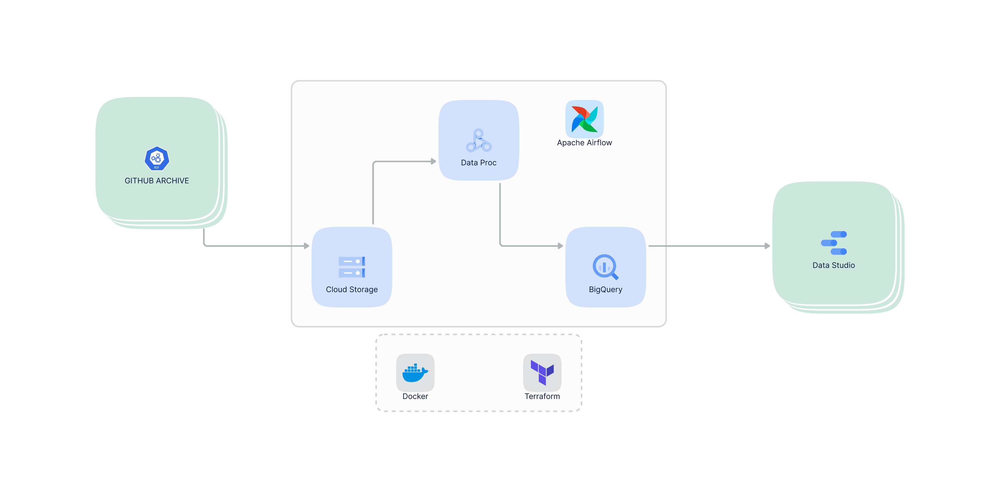
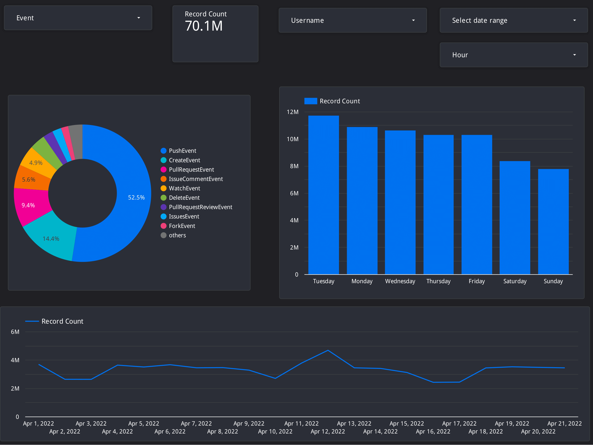

# Data Engineering Zoomcamp Project
This is my project for the [Data Engineering Zoomcamp](https://github.com/DataTalksClub/data-engineering-zoomcamp) by [DataTalks.Club](https://datatalks.club/)

Check my personal repository [here](https://github.com/Isaac-Tolu/data-engineering-zoomcamp)

## Table of Contents

## Problem Statement
- `DevTrack`, a developer-productivity company wants to create a new product for the developer community. 
- You have been hired to give insights on Github developer activity for April 2022.
- Here are some of your proposed end-goal questions:
    - On which day of the month was Github most active?
    - On which weekday is Github most active?
    - The most active day and weekday filtered by event? 

## About the Dataset
[Github Archive](https://www.gharchive.org/) is a project to record the public Github timeline, archive it, and make it accessible for further analysis.

## About the Project
- Github Archive data is ingested daily into a Data Lake
- The data in the Data Lake is transformed according to business requirements
- The results are written to 2 pre-defined tables in a Data Warehouse
- A dashboard is created from the data in the data warehouse

## Architecture


## Technologies / Tools
- Containerisation - [Docker](https://www.docker.com/)
- Infrastructure-as-Code (IaC) - [Terraform](https://www.terraform.io/)
- Cloud - [Google Cloud Platform](https://cloud.google.com/)
- Workflow Orchestration - [Airflow](https://airflow.apache.org/)
- Data Lake - [Google Cloud Storage](https://cloud.google.com/storage)
- Data Warehouse - [Google BigQuery](https://cloud.google.com/bigquery)
- Batch Processing - [Google DataProc](https://cloud.google.com/dataproc) 
- Visualisation - [Google Data Studio](https://datastudio.google.com/)

## Dashboard


> You can interact with the live dashboard [here](https://datastudio.google.com/reporting/4f8a63db-0d37-4b2b-a037-0b00206ec612)

## Reproducibility
### Pre-Requisites
#### Google Cloud Platform Account
1. Create a [GCP](https://cloud.google.com/) account if you do not have one. Note that GCP offers $300 free credits for 90 days
2. Create a new project from the GCP [dashboard](https://console.cloud.google.com/). Notr your project ID

#### Create a Service Account
1. Go to _IAM & Admin > Service Accounts_
2. Click `CREATE SERVICE ACCOUNT`. More information [here](https://cloud.google.com/docs/authentication/getting-started#creating_a_service_account)
3. Add the following roles to the service account:
    - `Viewer`
    - `Storage Admin`
    - `Storage Object Admin`
    - `BigQuery Admin`
    - `DataProc Administrator`
4. Download the private JSON keyfile. Rename it to `google_credentials.json` and store it in `${HOME}/.google/credentials/`
5. You would need to enable this APIs if you have not done already
    - [IAM API](https://console.cloud.google.com/apis/library/iam.googleapis.com)
    - [IAM Service Account Credentials API](https://console.cloud.google.com/apis/library/iamcredentials.googleapis.com)

#### Pre-Infrastructure Setup
Terraform is used to setup most of the infrastructure but the Virtual Machine and DataProc Cluster used for this project was created on the Cloud console. This aspect contain steps to setup this aspect of this project.

> You can also use your local machine to reproduce this project but it is much better to use a VM so as not to strain your system. If you still choose to use your local machine, install the necessary packages on your local machine.

##### Setting up a Virtual Machine on GCP
1. On the project dashboard, go to _Compute Engine > VM Instances_
2. Create a new instance
    - Use any name of your choosing
    - Choose a [region](https://cloud.google.com/about/locations) that suits you most
        > All your GCP resources should be in the same region
    - For machine configuration, choose the E2 series. An `e2-standard-2 (2 vCPU, 8 GB memory)` or `e2-standard-4 (4 vCPU, 16 GB memory)` is sufficient for this project
    - In the Boot disk section, change it to `Ubuntu` OS preferably `
Ubuntu 20.04 LTS`. A disk size of 30GB is also enough.
    - Leave all other settings on default value and click `Create`
> You would need to enable the [Compute Engine API](https://console.cloud.google.com/apis/library/compute.googleapis.com) if you have not already.

##### Setting up a DataProc Cluster on GCP
1. On the project dashboard, go to _DataProc > Clusters_
2. Create a new cluster
    - Use any name of your choosing, preferably `gharchive-cluster` as this is hard-coded in the docker-compose file
    - Choose the region you have used for other GCP resources
    - For Cluster Type, use `Standard (1 master, N workers)`
    - Leave other options on default and click `Create`
> You would need to enable the [Cloud Dataproc API](https://console.cloud.google.com/apis/library/dataproc.googleapis.com) if you have not already.

#### Installing Required Packages on the VM
Before installing packages on the VM, an SSH key has to be created to connect to the VM
##### SSH Key Connection
1. To create the SSH key, check this [guide](https://cloud.google.com/compute/docs/connect/create-ssh-keys)
2. Copy the public key in the `~/ssh` folder
3. On the GCP dashboard, navigate to _Compute Engine > Metadata > SSH KEYS_
4. Click `Edit`. Then click `Add Item`. Paste the public key and click `Save`
5. Go to the VM instance you created and copy the External IP
6. Go back to your terminal and type this command in your home directory
    ```bash
    ssh -i <path-to-private-key> <USER>@<External IP>
    ```  

- Google Cloud SDK
- Docker
- Terraform


### Main

### Dashboard
